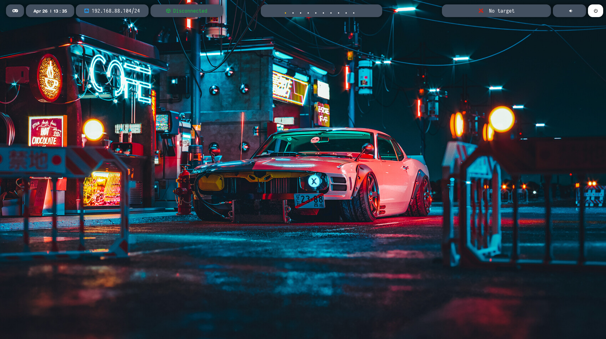
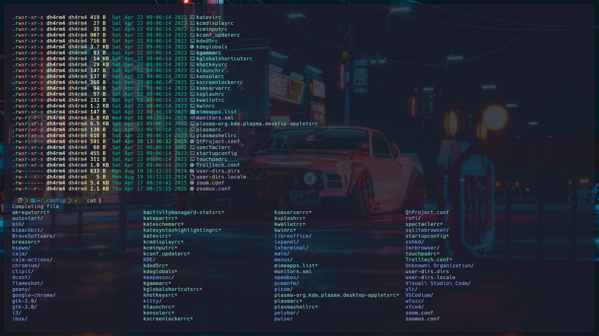
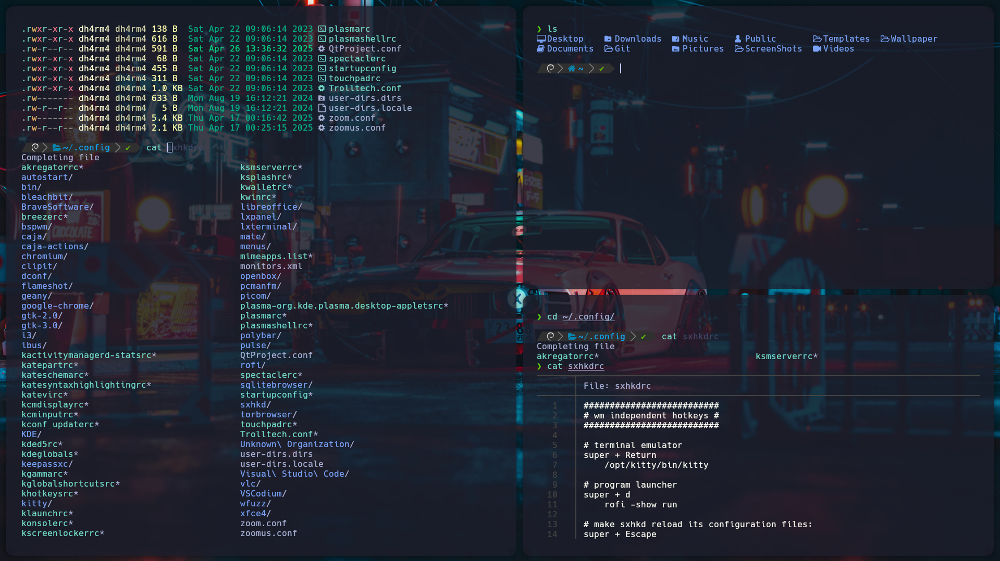

# 🦜 AutoParrotBSPWM

**AutoParrotBSPWM** es un instalador automático para configurar un entorno de escritorio ligero basado en **BSPWM** en **Parrot OS**.  
Este script instala dependencias, compila Polybar y Picom, configura ZSH con Powerlevel10k, instala fuentes, wallpapers, temas de Rofi y mucho más.

---

## 🚀 ¿Qué hace este script?

- Asegura que no lo ejecutes como root.
- Actualiza el sistema (`apt` + `parrot-upgrade`).
- Instala todas las dependencias necesarias para BSPWM, Polybar, Picom y ZSH.
- Clona, compila e instala:
  - [Polybar](https://github.com/polybar/polybar)
  - [Picom (ibhagwan fork)](https://github.com/ibhagwan/picom)
- Instala el tema **Powerlevel10k** para ZSH.
- Copia:
  - Temas de Rofi.
  - Wallpapers y carpetas de screenshots.
  - Configuraciones personalizadas para BSPWM, SXHKD, Kitty, Polybar, Rofi, etc.
  - Archivos de configuración de ZSH y Powerlevel10k.
- Instala fuentes personalizadas.
- Copia scripts útiles a `/usr/local/bin/`.
- Cambia la shell predeterminada a ZSH.
- Ejecuta el selector de temas de Rofi (opcional).
- Limpia carpetas temporales.

---

## 📋 Requisitos

- **Parrot OS** actualizado.
- Conexión a Internet.
- Usuario con permisos sudo.

---

## ⚡ Instalación

### 1. Cloná este repositorio:

```bash
git clone https://github.com/LJara92/AutoParrotBSPWM.git
cd AutoParrotBSPWM
```

### 2. Dale permisos de ejecución al script:

```bash
chmod +x install.sh
```

### 3. Ejecutá el instalador:

```bash
./install.sh
```

> ⚠️ **Importante**: No ejecutes el script como root. Usá tu usuario normal.

---

## 🛠️ Personalización

- **Temas de Rofi**: Podés cambiar el tema luego ejecutando `rofi-theme-selector`.
- **Wallpapers**: Se copian a `~/Wallpaper/`.
- **Shell**: ZSH queda como predeterminada con Powerlevel10k ya configurado.
- **Archivos importantes copiados**:
  - `~/.config/bspwm/`
  - `~/.config/sxhkd/`
  - `~/.config/rofi/`
  - `~/.config/kitty/`
  - `~/.zshrc`
  - `~/.p10k.zsh`

---

## 📸 Captura de pantalla





---

## ✨ Créditos

- Basado en la idea de [BSPWMparrot](https://github.com/xJackSx/BSPWMparrot) de @xJackSx.
- Inspirado en varios dotfiles y configuraciones de la comunidad.

---

## 📜 Licencia

Este proyecto está bajo la licencia MIT.  
Libre para usar, modificar y compartir.

---

## 🎯 Nota final

Este script es ideal para usuarios de Parrot OS que buscan un entorno de escritorio minimalista, rápido y totalmente personalizado en cuestión de minutos.  
¡Felices riceos! 🎨🐧
